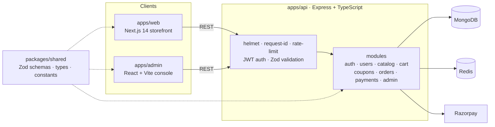

<div align="center">

# 🛍️ ShopSense AI

**Full-stack e-commerce platform: storefront, admin console and a typed REST API in one TypeScript monorepo.**


</div>

---

## Overview

ShopSense is a production-style commerce stack split into three apps that share one set of types and validation schemas. A change to a Zod schema in `packages/shared` is type-checked across the API, the storefront and the admin panel in the same build.

## Architecture



## Features

**Storefront** (`apps/web`)
- Catalog listing and product detail pages (`/catalog`, `/catalog/[slug]`)
- Cart, wishlist and checkout with Razorpay
- Account area with order history and order detail
- Server state via TanStack Query, client state via Zustand

**Admin console** (`apps/admin`)
- Catalog setup and order management
- Sales charts (Recharts) and data tables (TanStack Table)
- Image uploads to Cloudinary

**API** (`apps/api`)
- Feature-module layout: `auth`, `users`, `catalog`, `cart`, `coupons`, `orders`, `payments`, `admin`
- JWT access and refresh tokens, bcrypt password hashing
- Request validation with shared Zod schemas
- Security middleware: Helmet, CORS allow-list, Redis-backed rate limiting, request IDs
- Structured logging with Pino
- Razorpay payments with webhook signature verification
- PDF invoice generation (PDFKit) with GST store details
- Admin audit log and inventory log models
- Integration tests with Vitest and Supertest (auth, cart, catalog, checkout, coupons, admin)

## Tech stack

| Layer | Tools |
|:--|:--|
| Monorepo | pnpm workspaces, Turborepo, TypeScript 5 |
| Storefront | Next.js 14, React 18, Tailwind CSS, TanStack Query, Zustand |
| Admin | React 18, Vite 6, Tailwind CSS, TanStack Table, Recharts |
| API | Express 4, Mongoose 8, Zod, ioredis, Pino, PDFKit |
| Payments & media | Razorpay, Cloudinary |
| Testing & CI | Vitest, Supertest, GitHub Actions |
| Local infra | Docker Compose (MongoDB 7, Redis 7.2) |

## Project structure

```
.
├── apps/
│   ├── api/        # Express REST API (modules, middlewares, config, tests)
│   ├── web/        # Next.js storefront (App Router)
│   └── admin/      # React + Vite admin console
├── packages/
│   └── shared/     # Zod schemas, shared types and constants
├── docker-compose.yml
└── turbo.json
```

## Getting started

**Prerequisites:** Node.js 18+, pnpm, Docker

```bash
# 1. Install dependencies
pnpm install

# 2. Start MongoDB and Redis
docker compose up -d

# 3. Create env files from the examples and fill in your keys
cp apps/api/.env.example apps/api/.env
cp apps/web/.env.example apps/web/.env
cp apps/admin/.env.example apps/admin/.env

# 4. Seed sample data
pnpm seed

# 5. Run all apps in dev mode
pnpm dev
```

## Scripts

| Command | What it does |
|:--|:--|
| `pnpm dev` | Runs API, storefront and admin together via Turborepo |
| `pnpm build` | Builds every app and package |
| `pnpm test` | Runs the API test suite |
| `pnpm typecheck` | Type-checks the whole monorepo |
| `pnpm lint` | Lints every workspace |
| `pnpm seed` | Seeds the database with sample catalog data |

## Environment variables

Each app ships an `.env.example`. The API needs MongoDB, Redis, JWT secrets, Razorpay keys (including the webhook secret), Cloudinary credentials, email settings, and store legal details for invoices.

## Roadmap

- [ ] AI product recommendations and semantic search (provider config is already scaffolded in `.env.example`)
- [ ] Real-time order status updates over WebSockets
- [ ] Deployed demo

---

<div align="center">
Built by <a href="https://github.com/Siddharth-M-77">Siddharth Maddheshiya</a> · <a href="https://devsidd.cloud">devsidd.cloud</a>
</div>
